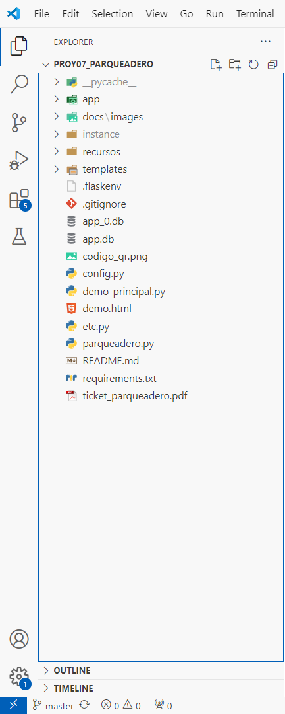
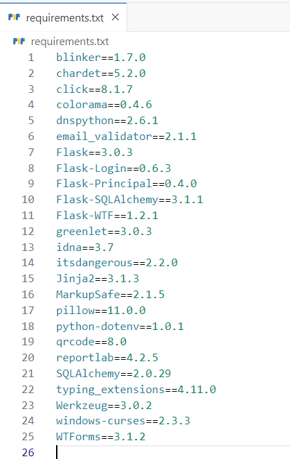
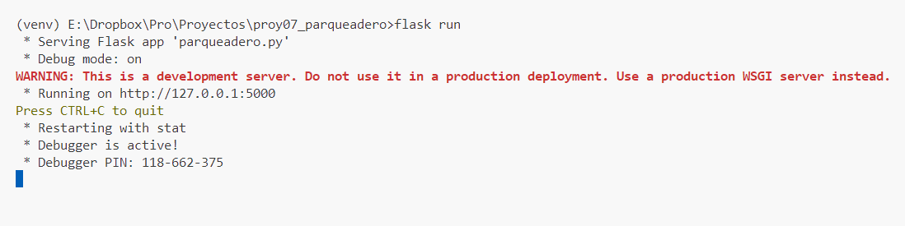
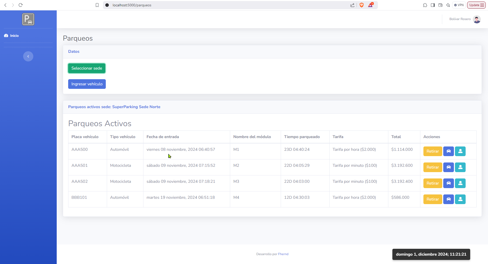
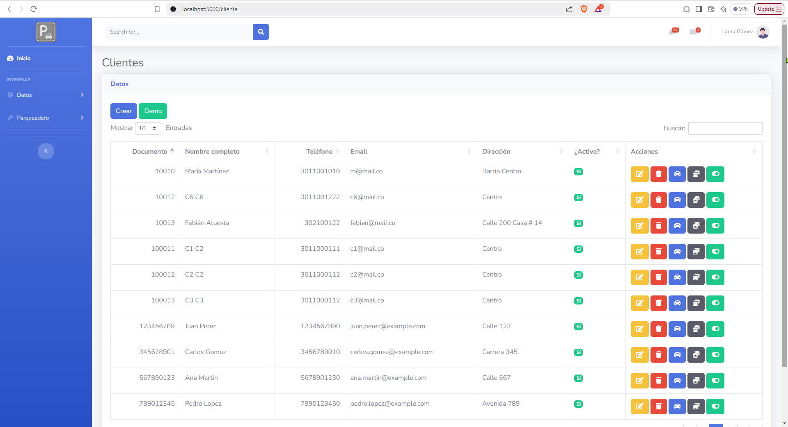
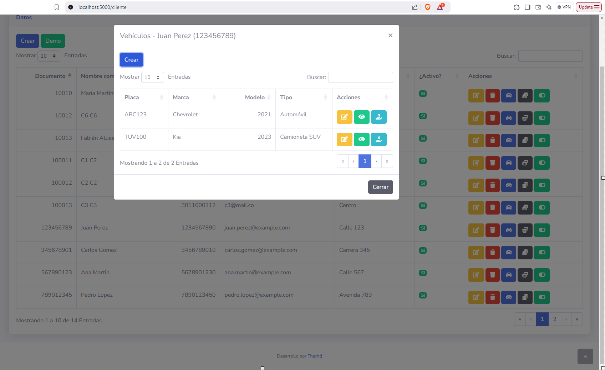
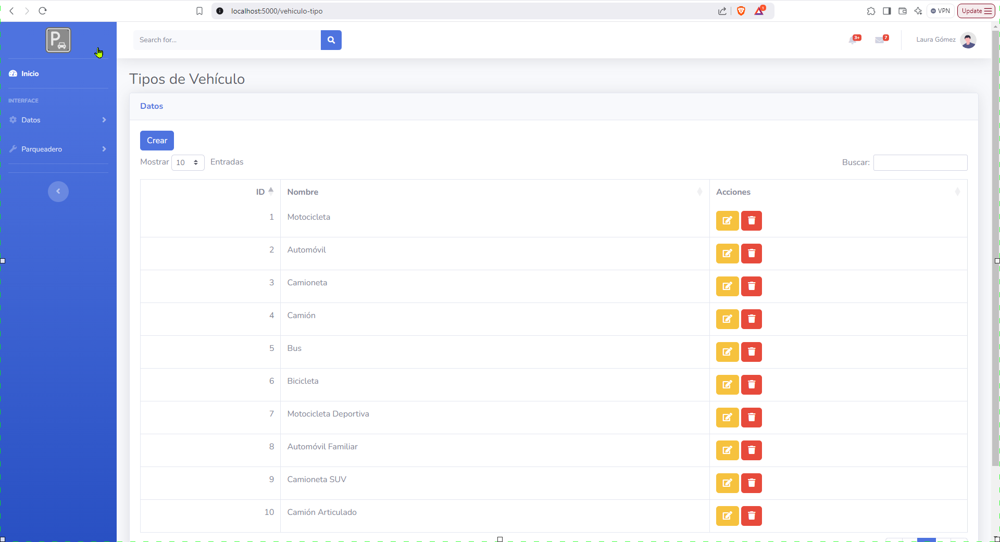
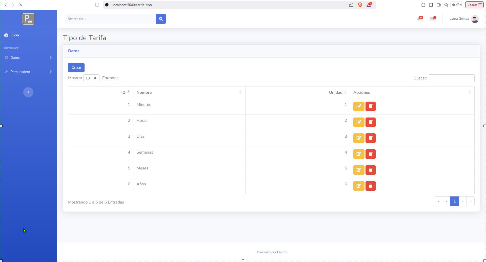

# 1. Introducción


Este proyecto comprende una aplicación para la gestión de un parqueadero. Se trata de una aplicación web en el que se proveen diferentes roles de usuario para la gestión de datos. Entre esos roles se cuenta:

- Propietario: representa a la persona encargada de la gestión de más alto nivel (o jerarquía) dentro de la aplicación. Puede crear otros usuarios y modificar datos. Es quien más permisos y autorizaciones tiene en la aplicación.

- Administrador: es un encargado por parte del propietario y sus tareas tienen que ver con la gestión de datos del parqueadero: clientes, vehículos, sedes, arrendamientos, sedes y módulos.

- Operario: es quien se encarga de gestionar la información del día a día del parqueadero. Monitoreo del ingreso y salida de vehículos del parqueadero. También cuenta con permisos para gestionar información básica relacionada con vehículos y clientes.

Esta aplicación tiene como objetivo principal la sistematización y automatización de las tareas rutinarias en un parqueadero de vehículos. Cuenta con una interfaz gráfica de usuario para tal objetivo. El control de la información es fundamental para precisar y calcular los tiempos y las tarifas de los vehículos que hacen uso del servicio de parqueadero.

# 2. Tecnologías usadas

Para el desarrollo de este proyecto web se utilizaron las siguientes tecnologías de desarrollo de software:

- Python
- JavaScript
- HTML
- CSS

Por cada una de estas tecnologías se usaron librerías para las siguientes tareas:

- ORM: para la gestión de datos de la base de datos relacional se utilizó SQLAlchemy.
- Flask: microframework para el desarollo de aplicaciones y APIs.
- Dinero.js: permite formatear valores monetarios.
- jQuery: librería que permite interactuar con el DOM de una manera más abreviada y rápida.
- MomentJS: formato de fechas y horas.

# 3. Instalación

## 3.1 Python

### 3.1.1 Instalación de Python en Windows

Sigue estos pasos para instalar Python en Windows:

1. **Descargar Python:**
   - Ve al sitio oficial de Python: [https://www.python.org/downloads/](https://www.python.org/downloads/).
   - Haz clic en el botón `Download Python [versión]` (se detectará automáticamente la versión adecuada para tu sistema).

2. **Ejecutar el instalador:**
   - Abre el archivo descargado (por ejemplo, `python-[versión].exe`).
   - **Marcar la casilla**: `Add Python to PATH` antes de continuar.
   - Haz clic en **Install Now** para realizar una instalación rápida.

3. **Verificar la instalación:**
   - Abre el terminal o `Command Prompt` (CMD).
   - Escribe:
     ```bash
     python --version
     ```
     o
     ```bash
     python -V
     ```
     Deberías ver la versión instalada.

4. **Opcional: Instalar `pip` (gestor de paquetes):**
   - Python incluye `pip` por defecto. Verifica que esté instalado con:
     ```bash
     pip --version
     ```

---

**Solución de problemas comunes**
- Si `python` no se reconoce en el terminal, verifica que esté agregado al **PATH**:
  - Ve a **Configuración avanzada del sistema** > **Variables de entorno**.
  - Asegúrate de que la carpeta de instalación de Python (por ejemplo, `C:\Python39\`) esté en la variable `PATH`.

¡Listo! Python debería estar funcionando en tu sistema. 🎉

### 3.1.2 Instalación de Python en Linux

Sigue estos pasos para instalar Python en tu sistema Linux:

1. **Actualizar los paquetes del sistema:**
   - Abre la terminal y ejecuta:
     ```bash
     sudo apt update
     sudo apt upgrade
     ```

2. **Instalar Python:**
   - Ejecuta el siguiente comando para instalar Python desde los repositorios oficiales:
     ```bash
     sudo apt install python3
     ```

3. **Verificar la instalación:**
   - Confirma que Python se haya instalado correctamente ejecutando:
     ```bash
     python3 --version
     ```

4. **Instalar `pip` (gestor de paquetes de Python):**
   - Si necesitas instalar `pip`, ejecuta:
     ```bash
     sudo apt install python3-pip
     ```

5. **Verificar la instalación de `pip`:**
   - Comprueba que `pip` esté instalado:
     ```bash
     pip3 --version
     ```

---

¡Python estará listo para usar en tu sistema Linux! 🎉


### 3.1.3 Instalación de Python 3 en macOS

Sigue estos pasos para instalar Python 3 en tu sistema macOS:

1. **Instalar Homebrew:**
   - Homebrew es un gestor de paquetes para macOS que facilita la instalación de software. Si no tienes Homebrew instalado, abre la Terminal y ejecuta el siguiente comando:
     ```bash
     /bin/bash -c "$(curl -fsSL https://raw.githubusercontent.com/Homebrew/install/HEAD/install.sh)"
     ```

2. **Actualizar Homebrew:**
   - Asegúrate de que Homebrew esté actualizado ejecutando:
     ```bash
     brew update
     ```

3. **Instalar Python 3:**
   - Utiliza Homebrew para instalar Python 3:
     ```bash
     brew install python
     ```

4. **Verificar la instalación:**
   - Confirma que Python 3 se haya instalado correctamente ejecutando:
     ```bash
     python3 --version
     ```

5. **Instalar `pip` (gestor de paquetes de Python):**
   - `pip` debería instalarse automáticamente con Python 3. Verifica su instalación ejecutando:
     ```bash
     pip3 --version
     ```

---

¡Python 3 estará listo para usar en tu sistema macOS! 🎉


## 3.2 Creación y activación de un ambiente virtual

### 3.2.1 Windows

1. Crear una carpeta

```bash
mkdir parqueadero
cd parqueadero
```

2. Crear ambiente virtual


```bash
python -m venv env
```

3. Activar ambiente virtual

```bash
env\Scripts\activate.bat
```

### 3.2.2 macOS / Linux

1. Crear una carpeta

```bash
mkdir parqueadero
cd parqueadero
```

2. Creación
```bash
python -m venv env
````

3. Activación
```bash
source env/bin/activate
```

## 3.3 Instalación de las librerías o dependencias del proyecto

Para poner en ejercución este proyecto es necesario con tar con las siguientes librerías:

- email-validator
- Flask
- Flask-Login
- Flask-Principal
- Flask-SQLAlchemy
- Flask-WTF
- QRCode
- ReportLab

Para poder instalar estas librerías ejecutamos el siguiente comando:

```bash
pip install -r requirements.txt
```

Tenga en cuenta que en otras plataformas operacionales el comando de PIP puede ser ```pip3```.

# 4. Ejecución del proyecto

Una vez instaladas las dependencias y con el ambiente virtual activo procedemos a ejecutar la aplicación web de gestión de parqueadero.

En la terminal escribimos:

```bash
flask run
```

# 5. Capturas de pantalla

## 5.1 Estructura de archivos y directorios



## 5.2 Dependencias o módulos Python



## 5.3 Ejecución del proyecto desde la terminal



## 5.4 Pantalla de inicio de sesión


## 5.5 Parqueos activos



## 5.6 Vista de clientes



## 5.7 Vista de los vehículos de un cliente



## 5.8 Vista de los tipos de vehículo



## 5.9 Vista de los tipos de tarifa


